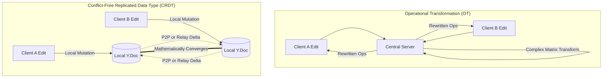
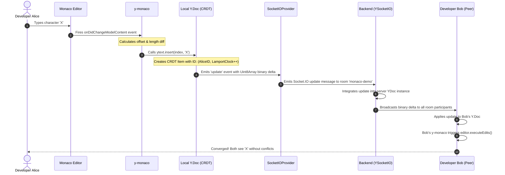

# 🚀 SyncPad — Real-Time Collaborative Code Editor

> **A high-performance, conflict-free collaborative coding platform powered by CRDTs (Yjs), Monaco Editor, and Socket.IO.**

[](https://react.dev/)
[](https://microsoft.github.io/monaco-editor/)
[](https://yjs.dev/)
[](https://socket.io/)
[](https://expressjs.com/)
[](https://tailwindcss.com/)
[](https://vitejs.dev/)

---

## 📑 Table of Contents

- [1. Executive Overview](#1-executive-overview)
- [2. The Core Problem: Concurrency in Distributed Editing](#2-the-core-problem-concurrency-in-distributed-editing)
- [3. Mathematical Foundation: Why CRDTs over OT?](#3-mathematical-foundation-why-crdts-over-ot)
- [4. Deep-Dive Architecture & Data Flow](#4-deep-dive-architecture--data-flow)
  - [4.1 High-Level Topology](#41-high-level-topology)
  - [4.2 End-to-End Edit Transaction Lifecycle](#42-end-to-end-edit-transaction-lifecycle)
- [5. How the Tech Stack Fits Together](#5-how-the-tech-stack-fits-together)
  - [5.1 Monaco Editor Layer](#51-monaco-editor-layer)
  - [5.2 Yjs CRDT Engine (`Y.Doc` & `Y.Text`)](#52-yjs-crdt-engine-ydoc--ytext)
  - [5.3 Monaco Binding (`y-monaco`)](#53-monaco-binding-y-monaco)
  - [5.4 Network & Transport Protocol (`y-socket.io`)](#54-network--transport-protocol-y-socketio)
  - [5.5 Awareness & Peer Presence Protocol](#55-awareness--peer-presence-protocol)
- [6. Project Directory Blueprint](#6-project-directory-blueprint)
- [7. Codebase Walkthrough](#7-codebase-walkthrough)
  - [7.1 Backend Implementation (`Backend/server.js`)](#71-backend-implementation-backendserverjs)
  - [7.2 Frontend Application (`Frontend/src/app/App.jsx`)](#72-frontend-application-frontendsrcappappjsx)
- [8. Getting Started & Local Development Setup](#8-getting-started--local-development-setup)
  - [8.1 Prerequisites](#81-prerequisites)
  - [8.2 Backend Installation & Launch](#82-backend-installation--launch)
  - [8.3 Frontend Installation & Launch](#83-frontend-installation--launch)
  - [8.4 Simulating Multi-User Collaboration](#84-simulating-multi-user-collaboration)
- [9. Network Protocol & API Specifications](#9-network-protocol--api-specifications)
- [10. Technical Comparison: CRDT vs Operational Transformation](#10-technical-comparison-crdt-vs-operational-transformation)
- [11. Observations, Gotchas & Recommendations](#11-observations-gotchas--recommendations)
- [12. Planned Roadmap & Production Enhancements](#12-planned-roadmap--production-enhancements)
- [13. Author & Credits](#13-author--credits)

---

## 1. Executive Overview

**SyncPad** is a full-stack, distributed, real-time collaborative code editor designed to provide instantaneous peer synchronization and zero merge conflicts. Modeled after collaborative developer tools like VS Code Live Share and Google Docs, SyncPad lets multiple engineers open the same code workspace, make simultaneous changes to identical lines of code, and experience immediate convergence across all clients without a centralized lock.

SyncPad harnesses **Monaco Editor** (the industry-standard code editor engine that powers Visual Studio Code) for code presentation, syntax highlight, and cursor tracking. Underlying the editor is **Yjs**, a high-performance **Conflict-free Replicated Data Type (CRDT)** library that mathematically guarantees convergence across all peers, synchronized over bidirectional WebSockets via **Socket.IO**.

---

## 2. The Core Problem: Concurrency in Distributed Editing

Building a real-time collaborative editor is notoriously difficult due to **network latency**, **out-of-order message delivery**, and **concurrent edits**.

Consider two developers, **Alice** and **Bob**, editing a shared document initially containing:
```text
"HELLO"
```

1. **Alice** (at offset 0) decides to insert `"SAY "` → Local document: `"SAY HELLO"`
2. **Bob** (at offset 5) concurrently decides to insert `" WORLD"` → Local document: `"HELLO WORLD"`

### The Naive Approach (Diff/Snapshot Exchange)
If Alice and Bob send raw document snapshots or naive `{ index, char }` packets:
- Alice's insert arrives at Bob's client: Bob inserts `"SAY "` at offset 0 → Bob sees `"SAY HELLO WORLD"`.
- Bob's insert arrives at Alice's client: Alice inserts `" WORLD"` at offset 5. Because Alice already prepended `"SAY "` (4 chars), offset 5 is right in the middle of `"SAY HELLO"`! Alice ends up with `"SAY H WORLD ELLO"`.
- **Result:** The documents diverge permanently. The system is corrupted.

---

## 3. Mathematical Foundation: Why CRDTs over OT?

To resolve concurrent edits, systems historically used **Operational Transformation (OT)** or **Conflict-free Replicated Data Types (CRDTs)**.



### 3.1 Operational Transformation (OT)
- Popularized by Google Docs, Etherpad, and Apache Wave.
- Requires incoming operations to be transformed against all concurrent operations via transformation functions $T(op_1, op_2)$.
- **Downside:** Requires an authoritative central server to sequence all operations into a single linear history. Complex transformation matrix with hundreds of edge-case bugs. High server memory and latency penalty.

### 3.2 Conflict-free Replicated Data Types (CRDT)
SyncPad utilizes **Yjs**, a state-of-the-art CRDT implementation. Rather than shifting character positions by numerical index:
1. **Unique Identifiers:** Every character/token inserted is wrapped in an internal item with a globally unique identifier: `(clientID, clock)`.
2. **Relative Placement:** Characters reference their left and right neighbors rather than an absolute string index.
3. **Idempotence, Commutativity, Associativity:**
   - **Commutativity:** $A \circ B = B \circ A$ (Edits can arrive in any order and produce identical state).
   - **Associativity:** $(A \circ B) \circ C = A \circ (B \circ C)$ (Batching does not impact outcome).
   - **Idempotence:** $A \circ A = A$ (Duplicate network packets have zero side effects).
4. **Strong Eventual Consistency (SEC):** As soon as all clients receive the same set of updates (regardless of arrival order), their document states are mathematically guaranteed to be identical.

---

## 4. Deep-Dive Architecture & Data Flow

### 4.1 High-Level Topology

```mermaid
flowchart TB
    subgraph Client_A ["Client A (Browser)"]
        UI_A["React UI"]
        Monaco_A["Monaco Editor (VS Code Engine)"]
        Binding_A["y-monaco Binding"]
        YDoc_A["Yjs Document (CRDT Store)"]
        Provider_A["SocketIOProvider (y-socket.io)"]

        UI_A --> Monaco_A
        Monaco_A <-->|Model Changes & Remote Ops| Binding_A
        Binding_A <-->|Text Operations| YDoc_A
        YDoc_A <-->|Binary Delta Updates| Provider_A
    end

    subgraph Server ["Node.js / Express Backend (Relay & State Broker)"]
        HTTP["HTTP Server (Port 3000)"]
        SIO["Socket.IO Server (CORS Enabled)"]
        YServer["YSocketIO Handler"]
        Rooms["Room Channel: 'monaco-demo'"]

        HTTP --> SIO
        SIO --> YServer
        YServer --> Rooms
    end

    subgraph Client_B ["Client B (Browser)"]
        Provider_B["SocketIOProvider (y-socket.io)"]
        YDoc_B["Yjs Document (CRDT Store)"]
        Binding_B["y-monaco Binding"]
        Monaco_B["Monaco Editor (VS Code Engine)"]
        UI_B["React UI"]

        Provider_B <-->|Binary Delta Updates| YDoc_B
        YDoc_B <-->|Text Operations| Binding_B
        Binding_B <-->|Model Changes & Remote Ops| Monaco_B
        Monaco_B --> UI_B
    end

    Provider_A <===>|WebSocket (Socket.IO)| Rooms
    Rooms <===>|WebSocket (Socket.IO)| Provider_B
```

---

### 4.2 End-to-End Edit Transaction Lifecycle

When a user presses a key inside the editor, SyncPad executes the following synchronization cycle in single-digit milliseconds:



---

## 5. How the Tech Stack Fits Together

### 5.1 Monaco Editor Layer
- **Package:** `@monaco-editor/react` (v4.7.0)
- **Role:** Provides the full coding surface used by Visual Studio Code. Includes syntax highlighting, code folding, intellisense popups, and line numbers.
- **Theme:** Configured with `vs-dark` theme and `javascript` language mode by default.

### 5.2 Yjs CRDT Engine (`Y.Doc` & `Y.Text`)
- **Package:** `yjs` (v13.6.31)
- **Role:** In-memory CRDT graph.
  - `const ydoc = new Y.Doc()` initializes an isolated shared document instance.
  - `const ytext = ydoc.getText("monaco")` instantiates a shared linear text type.
  - Every character deletion is marked with a lightweight tombstone to preserve relative positional context without bloat.
  - Internally optimizes operations into variable-length integers and contiguous chunks (StructStore) for minimal memory footprint and fast binary serialization.

### 5.3 Monaco Binding (`y-monaco`)
- **Package:** `y-monaco` (v0.1.6)
- **Role:** Two-way synchronization bridge between Monaco's DOM/TextModel and Yjs's `Y.Text`.
  - Captures Monaco mutations (`onDidChangeModelContent`) and applies corresponding operations to `ytext`.
  - Listens to Yjs transactions (`ytext.observe()`) and calls Monaco's `editor.executeEdits()`.
  - Handles **Cursor Decoration**: Renders remote cursors and selection ranges within Monaco using CSS classes mapped to user IDs.

### 5.4 Network & Transport Protocol (`y-socket.io`)
- **Packages:** `y-socket.io` (v1.1.3), `socket.io` (v4.8.3)
- **Role:** Network transport layer.
  - Replaces traditional WebRTC or plain WebSocket relays with Socket.IO's robust framing, auto-reconnection, and fallback mechanisms.
  - Partitions editing sessions by named rooms (`"monaco-demo"`).
  - Handles the initial 2-step synchronization handshake:
    1. **Sync Step 1:** Client sends its local State Vector (summary of revisions seen).
    2. **Sync Step 2:** Server responds with missing binary deltas.
    3. **Continuous Sync:** All new deltas stream continuously in real time.

### 5.5 Awareness & Peer Presence Protocol
- **Object:** `provider.awareness`
- **Role:** Ephemeral presence synchronization.
  - Unlike document edits (which are permanent CRDT history), presence states (who is online, current username, active cursor location) are transient.
  - `provider.awareness.setLocalStateField("user", { username })` broadcasts user identity.
  - Remote clients subscribe to `provider.awareness.on("change", ...)` to re-render the connected user roster.
  - Automatically handles disconnects or window unloads via `handleBeforeUnload` to remove disconnected users.

---

## 6. Project Directory Blueprint

```text
SyncPad-main/
│
├── README.md                      # Comprehensive project documentation
├── .gitignore                     # Git ignore rules for workspace
│
├── Backend/                       # Node.js / Express / Socket.IO Server
│   ├── package.json               # Backend dependencies & npm scripts
│   ├── package-lock.json          # Locked dependency tree
│   └── server.js                  # Express setup, HTTP server, YSocketIO integration
│
└── Frontend/                      # Vite + React 19 Client
    ├── index.html                 # HTML entry point (Mounts #root)
    ├── vite.config.js             # Vite configuration with React & Tailwind plugins
    ├── package.json               # Frontend dependencies & npm scripts
    ├── package-lock.json          # Locked dependency tree
    ├── eslint.config.js           # Modern ESLint flat config
    ├── public/                    # Static assets
    └── src/
        ├── main.jsx               # React DOM root entry point (<StrictMode>)
        └── app/
            ├── App.jsx            # Core UI, Monaco mounting, Yjs & awareness bindings
            └── App.css            # Tailwind CSS import
```

---

## 7. Codebase Walkthrough

### 7.1 Backend Implementation (`Backend/server.js`)

The backend is an Express and Socket.IO server configured as an ES module (`"type": "module"`).

```javascript
import express from "express"
import { createServer } from "http"
import { Server } from "socket.io"
import { YSocketIO } from "y-socket.io/dist/server"

const app = express()
const httpServer = createServer(app)

// Initialize Socket.IO with open CORS policy for local development
const io = new Server(httpServer, {
    cors: {
        origin: "*",
        methods: ["GET", "POST"]
    }
})

// Initialize the Yjs Socket.IO synchronization server
const ySocketIO = new YSocketIO(io)
ySocketIO.initialize()

// HTTP Endpoints
app.get("/", (req, res) => {
    res.status(200).json({ message: "Hello World", success: true })
})

app.get('/health', (req, res) => {
    res.status(200).json({ message: "Ok", success: true })
})

// Bind server to port 3000
httpServer.listen(3000, () => {
    console.log("App is listening to port 3000")
})
```

#### Key Mechanics:
- `YSocketIO(io)` attaches directly to the Socket.IO instance.
- It automatically handles room joins and negotiates CRDT updates between connecting clients.
- Provides health-check probes (`/health`) suitable for uptime monitors and container orchestration.

---

### 7.2 Frontend Application (`Frontend/src/app/App.jsx`)

The frontend application manages user identity, Monaco lifecycle, and real-time CRDT synchronization.

#### 1. Identity & Room Entry
```javascript
const [username, setUsername] = useState(() => {
  return new URLSearchParams(window.location.search).get("username") || ""
})
```
- If no username is set, a modern join modal is presented asking for user identity.
- Alternatively, users can pass `?username=Alice` directly via the URL for zero-click entry.

#### 2. CRDT Document Initialization
```javascript
const ydoc = useMemo(() => new Y.Doc(), [])
const ytext = useMemo(() => ydoc.getText("monaco"), [ydoc])
```
- A persistent `Y.Doc` instance is created using `useMemo` so it survives component re-renders.
- A shared text reference named `"monaco"` is extracted from the CRDT graph.

#### 3. Socket.IO Provider & Monaco Binding
```javascript
useEffect(() => {
  if (username && editorRef.current) {
    // 1. Establish real-time connection to backend room "monaco-demo"
    const provider = new SocketIOProvider("http://localhost:3000", "monaco-demo", ydoc, {
      autoConnect: true,
    })

    // 2. Announce identity to awareness pool
    provider.awareness.setLocalStateField("user", { username })

    // 3. Track remote peer joins/leaves
    provider.awareness.on("change", () => {
      const states = Array.from(provider.awareness.getStates().values())
      setUsers(states.filter(user => user && user.username).map(state => state.user))
    })

    // 4. Bind Monaco's buffer to Yjs CRDT
    const monacoBinding = new MonacoBinding(
      ytext,
      editorRef.current.getModel(),
      new Set([editorRef.current]),
      provider.awareness
    )

    // Cleanup on unmount or user change
    return () => {
      monacoBinding.destroy()
      provider.disconnect()
    }
  }
}, [editorRef.current, username])
```

---

## 8. Getting Started & Local Development Setup

Follow these instructions to run the complete SyncPad development environment on your local machine.

### 8.1 Prerequisites
- **Node.js**: `v18.0.0` or higher (`v20+` recommended)
- **npm**: `v9.0.0` or higher
- Modern Chromium, Firefox, or Safari browser

---

### 8.2 Backend Installation & Launch

1. Open a terminal and navigate to the `Backend` directory:
   ```bash
   cd Backend
   ```

2. Install backend dependencies:
   ```bash
   npm install
   ```

3. Launch the server in development mode (using nodemon for automatic reload):
   ```bash
   npm run dev
   ```
   *Alternatively, start with standard Node:*
   ```bash
   npm start
   ```

4. Confirm backend status:
   Open your browser or run `curl`:
   ```bash
   curl http://localhost:3000/health
   # Response: {"message":"Ok","success":true}
   ```

---

### 8.3 Frontend Installation & Launch

1. Open a second terminal window and navigate to the `Frontend` directory:
   ```bash
   cd Frontend
   ```

2. Install frontend dependencies:
   ```bash
   npm install
   ```

3. Launch the Vite development server:
   ```bash
   npm run dev
   ```

4. Access the client:
   Vite will serve the app (typically at `http://localhost:5173`). Open the URL in your browser.

---

### 8.4 Simulating Multi-User Collaboration

To test live collaboration on a single machine:

1. **User 1 (Alice):**
   Open a browser window and navigate to:
   ```text
   http://localhost:5173/?username=Alice
   ```
2. **User 2 (Bob):**
   Open an **Incognito / Private Window** (or a second browser) and navigate to:
   ```text
   http://localhost:5173/?username=Bob
   ```
3. **Verify:**
   - Notice **Alice** and **Bob** both appear in the left-hand user roster.
   - Type code in Alice's editor: Bob's editor reflects the exact keystrokes in real time.
   - Edit simultaneously on different lines: all updates merge cleanly without overwrites or cursor jumps.

---

## 9. Network Protocol & API Specifications

### 9.1 REST Endpoints

| Method | Route | Description | Response Schema |
| :--- | :--- | :--- | :--- |
| `GET` | `/` | Root handshake probe | `{"message": "Hello World", "success": true}` |
| `GET` | `/health` | Server health check probe | `{"message": "Ok", "success": true}` |

### 9.2 Socket.IO Event Structure

SyncPad leverages `y-socket.io` for protocol multiplexing:

```text
WebSocket Connection
│
├── Room: "monaco-demo" (or custom room ID)
│   ├── Event: 'sync-step-1'      -> Client sends local StateVector
│   ├── Event: 'sync-step-2'      -> Server answers with missing delta updates
│   ├── Event: 'update'           -> Bidirectional stream of binary CRDT updates
│   └── Event: 'awareness-update' -> Ephemeral presence (username, active cursor)
```

---

## 10. Technical Comparison: CRDT vs Operational Transformation

| Parameter | Operational Transformation (OT) | CRDT (SyncPad / Yjs) |
| :--- | :--- | :--- |
| **Architectural Model** | Centralized client-server topology | Decentralized / Peer-to-Peer / Relay |
| **Server Requirements** | High CPU (must compute transformation matrices) | Minimal (acts as binary packet forwarder) |
| **Offline Capability** | Poor (requires continuous lockstep server ACK) | Native (edits merge automatically upon reconnect) |
| **Algorithmic Complexity** | $O(N^2)$ transformation combinations | $O(1)$ to $O(N \log N)$ block insertion |
| **Network Resilience** | Packet reordering breaks consistency | Order-independent (fully commutative) |
| **Memory Efficiency** | High server history log | Compact binary delta encoding |

---

## 11. Observations, Gotchas & Recommendations

While examining the codebase, here are a few key implementation observations and quick wins for contributors:

1. **User List Rendering Return Statement (`App.jsx`):**
   In `Frontend/src/app/App.jsx` (lines 114–118), the user list map is written as:
   ```jsx
   {users.map((user, index) => {
     <li key={index} className="p-2 bg-gray-800 text-white rounded mb-2">
       {user.username}
     </li>
   })}
   ```
   *Tip:* The curly braces `{}` require an explicit `return <li ... />` or parentheses `(...)` for the user items to render into the DOM.
2. **Dynamic Room Partitioning:**
   The room name is currently hardcoded to `"monaco-demo"`. Adding `new URLSearchParams(window.location.search).get("room") || "default"` allows users to share custom workspace links (e.g. `?room=project-apollo`).
3. **Document Persistence:**
   The backend currently stores documents in memory. If the Node.js process restarts, state resets. Adding `y-leveldb` or a Redis adapter enables document persistence across server restarts.

---

## 12. Planned Roadmap & Production Enhancements

- [ ] **Multi-Room & Workspace Routing:** Dynamic URL routing (`/room/:roomId`) with private invite links.
- [ ] **Multi-Language Selector:** Language dropdown in the toolbar (Python, TypeScript, Go, C++, Rust, JSON, HTML).
- [ ] **Remote Cursor Carets & Labels:** Inject customized CSS color badges displaying collaborator names alongside their cursor in Monaco.
- [ ] **Cloud Sandboxed Code Execution:** Integration with execution backends (e.g., Piston or WebAssembly) to run code directly inside the browser.
- [ ] **Document Persistence:** Storage adapters with PostgreSQL / Redis / LevelDB for document durability.
- [ ] **Containerization & Deployment:** Dockerfile and Docker Compose configurations for one-command deployment to AWS ECS / DigitalOcean / Render.

---

## 13. Author & Credits

- **Author:** Ansh Pratap
- **Core Technologies:**
  - [Yjs Project](https://github.com/yjs/yjs) by Kevin Jahns
  - [Monaco Editor](https://github.com/microsoft/monaco-editor) by Microsoft
  - [Socket.IO](https://socket.io/) by Guillermo Rauch & contributors
